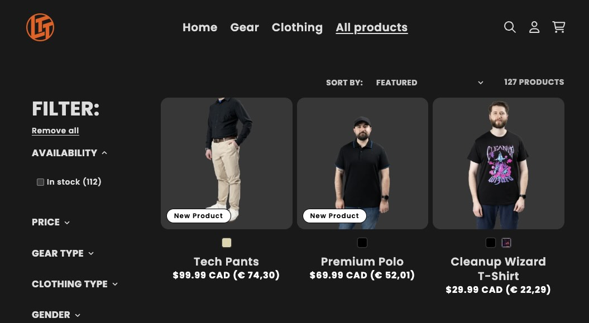
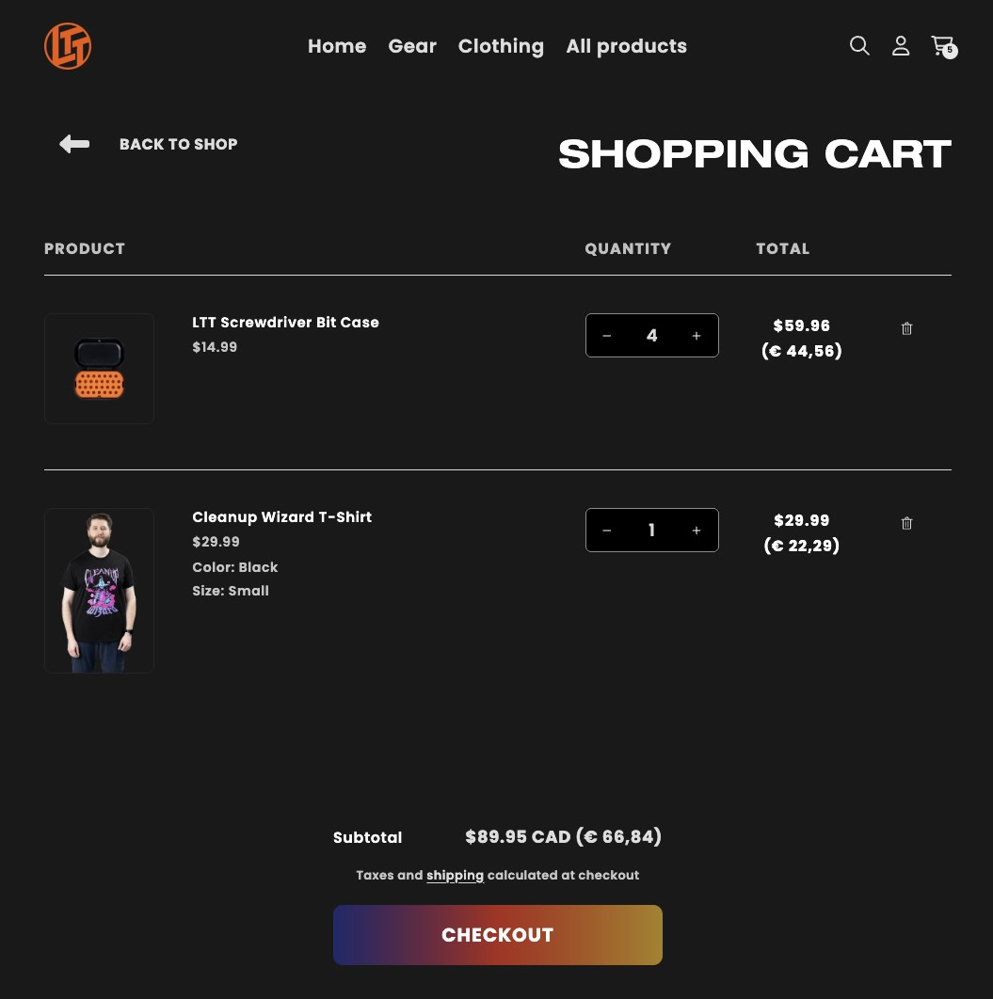
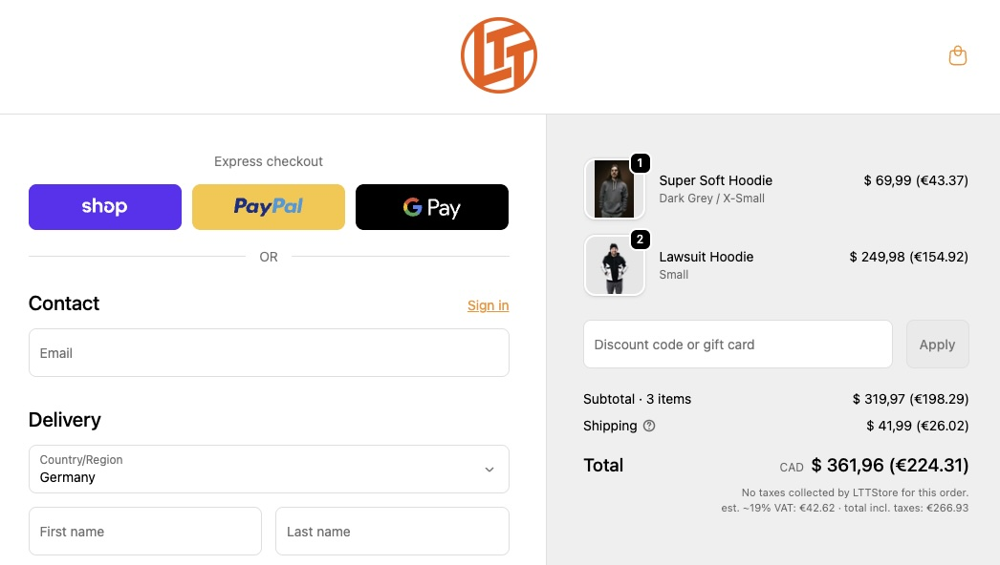

# Global-LTTStore.com-EU-Price
A small Chrome Extension checking the currency conversion from CAD to EUR and adding VAT to the global LTTStore.com price created with ChatGPT, Claude and vibe coding.

## Information
This extension pulls the CAD/EUR conversion rate once a day and adds it in brackets to the CAD pricing with VAT included. The price with VAT also is added to the cart.

During checkout, it will NOT add the VAT but only convert the net price from CAD to EUR as "Added Taxes" is extra due to the VAT being applied to shipping cost. To not make it confusing, it will not add VAT there.

## Bugs
Depending on how fast the checkout loads, the total price conversion sometimes is wrong there. Product pages and cart are fine though.

## How To Install (Chrome)

> This is an unpacked (developer) install.

1. Download the repo: **Code → Download ZIP**, then unzip  

2. Open Chrome’s Extensions page: `chrome://extensions`

3. Turn on **Developer mode** (top-right).

4. Click **Load unpacked** and select the folder that contains `manifest.json`.

5. (Optional) Pin it: click the puzzle-piece **Extensions** icon → **Pin**.
   
### Update after pulling new changes
Go back to `chrome://extensions` and click **Reload** on the extension card.
The folder must remain, once it is deleted, the extension will not work anymore.

## Credits
Inspired by [LTTStoreRealPrice](https://github.com/highfly117/LTTStoreRealPrice) by [highfly117](https://github.com/highfly117) (MIT License).
Since LTTStore.com is split between global and US the plug-in did not work anymore and I could not easily fix the USD/CAD conversion. It is a better extension so if you know how to fix it, it would make this one superluous.

## Images

